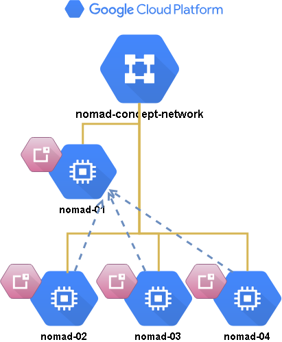

  
  

# Google Cloud - Nomad IaC




``Version 1.1.0``  

## Description
Simple terraform code which will provision instances with Nomad agents ready to start your jobs.

`startup.sh` will install nomad and docker on each instance.
For custom requirements just place them inside script.  
`provisioners` in main code will copy config.hcl and nomad.service files to server and also install goss for unit testing.  
`test.tf` trough null_resource will copy simple uni test for both server and slave testing and run test everytime any of nodes is rebuild.

``note``: instance with 01 (count 0) is consider as server always.

Currently only 1 server and X slaves is supported.

## Structure

```
gcloud-nomad-iac
    scripts
      |— startup.sh
      |— nomad-server.service
      |— nomad-slave.service
      |— server.hcl
      |— slave.hcl
    secret
      |— nomad.json
      |— nomad_id_rsa
      |— nomad_id_rsa.pub
    test
      |— goss-nomad-server.yaml
      |— goss-nomad-slave.yaml
    |— main.tf
    |— dns.tf
    |— test.tf
    |— provider.tf
    |— outputs.tf
    |— variables.tf
```


## Usage

``note:`` nomad.json,nomad_id_rsa,nomad_id_rsa.pub are just dummy empty files. You will need to replace them with your own.

You will need to generate SSH keys as follows:

```sh
$ ssh-keygen -f ./secret/nomad_id_rsa
# press <Enter> when asked (twice) for a pass-phrase
```

Then [download your credentials from Google Cloud Console](https://www.terraform.io/docs/providers/google/#credentials); suggested path for downloaded file is `./secret/nomad.json`.

Create `terraform.tfvars` file with your project variables. YOu can use `terrraform.tfvars.example` as template.

Modify `dns.tf` if you want to create public dns zones (disabled by default)

After you run `terraform apply` on this configuration, it will
automatically output the public IP address of all hosts.

## Nomad ui

UI is available at http://nomad-01:4646/ui

## Maintainer
`Simian Labs` - (https://github.com/simianlabs)  
http://simianlabs.io || sl@simianlabs.io